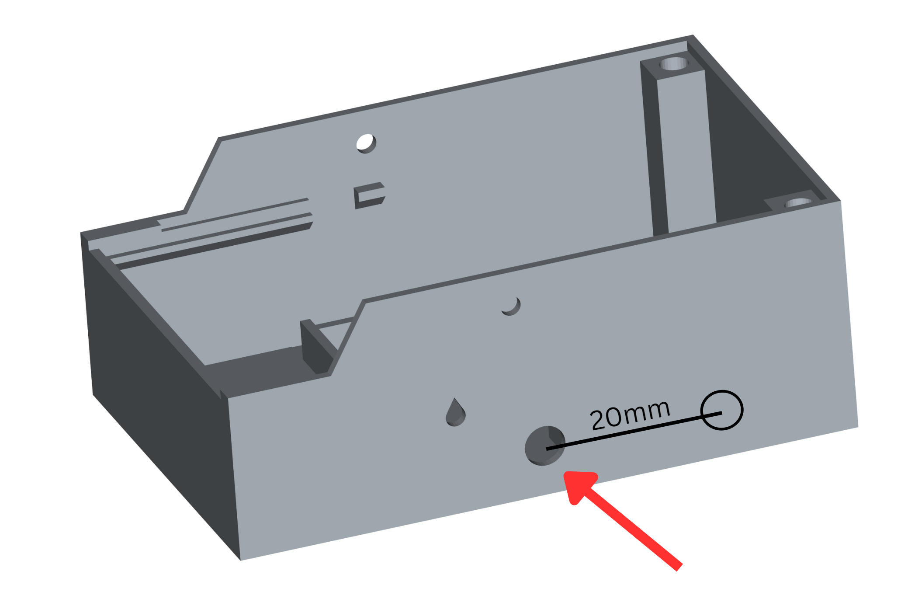
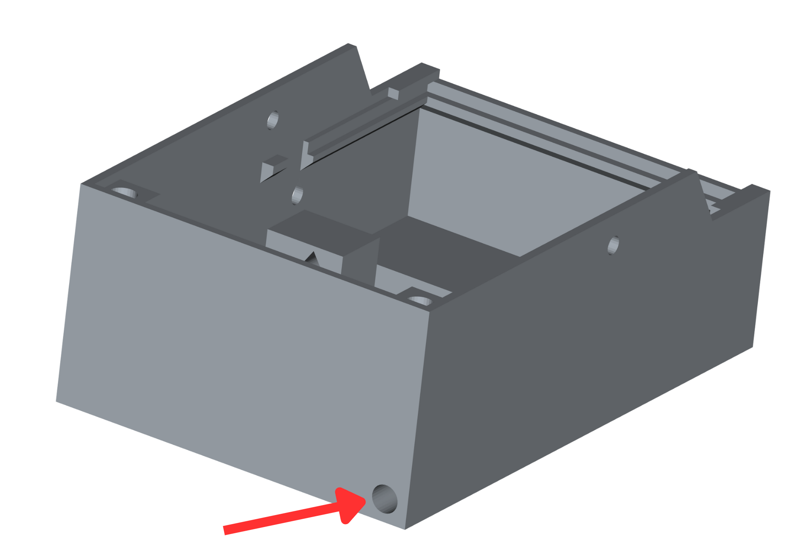
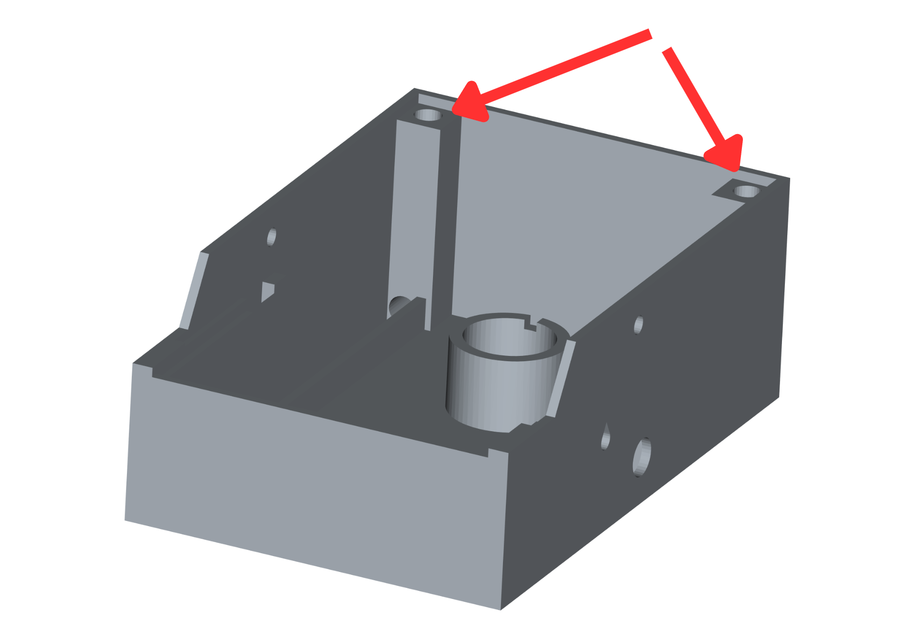

# Stylophone Documentation

### 1. Assembling the Circuit Board
When assembling a circuit board, always start with the smallest components (capacitors, resistors, and diodes) and proceed to the largest ones.

For the resistors, it is important that they closely match the specified values to ensure that the pads correspond to a musical scale without significant jumps between tones. Since many resistor values are not standard, several resistors may need to be connected in parallel or series (soldered on top of each other).

For the IC, ensure that it is soldered with the correct orientation. Pin 1 is usually marked with a dot or a line.

### 2. Preparing Wires
Cut 4 red wires and 6 black wires, each with a diameter of 0.2mm (or 0.25mm if necessary) and a length of 120mm. Additionally, cut one red and two black wires to a length of 230mm. Strip 10mm of isolation from both ends of all wires.

### 3. Speaker
Solder one red and one black wire, each 230mm long, to the speaker. The polarity does not matter here since it only determines whether the speaker moves inward or outward. However, if multiple speakers are used, ensure they are all connected with the same polarity to prevent interference between sound waves, which could distort the sound. Use automotive soldering paste to solder the wires to the speaker housing. This paste contains a special, more aggressive flux that ensures a better connection to the metal (iron).

### 4. Potentiometer
Two potentiometers are needed, one with a value of 1k and the other with 50k. Solder a black wire to each terminal of the potentiometers.

### 5. Soldering the Prepared Components
Now solder all the components that were prepared earlier (speaker and potentiometers) onto the circuit board according to the BOM file.

**Notes:**
- **Speaker:** Solder the speaker on the side opposite the buttons.
- **Potentiometer 1k:** Solder this next to the speaker at the location with three holes arranged in a row.
- **Potentiometer 50k:** Solder this to the remaining set of three holes.
- **Battery Clip:** Solder this next to the buttons, with the red wire facing downward (towards the large copper areas).
- **Stylus Wire:** The stylus wire is soldered after the circuit board is installed in the enclosure. However, one end of the wire must be soldered beforehand. Use a 230mm long wire and solder it to the single hole near the diode.

### 6. Initial Testing
Once all components are soldered, the circuit board can be powered on. Before doing so, inspect all solder joints to ensure they are correct, especially the IC orientation. Perform a basic short circuit check by measuring the resistance across the power supply; it should not be too low. Finally, power the circuit with a fully charged 9V block battery.

### 7. Building the Enclosure
The enclosure is typically 3D-printed. Since a hole for one potentiometer is missing and the existing one is too small, these must be drilled or re-drilled.

- **Potentiometer Hole:** Use a 5.5mm drill to enlarge the existing hole (see Figure 1). Measure 20mm to the right from the center of this hole and drill another 5.5mm hole there.

    

  _Figure 1_
  
- **Potentiometer Mounting:** Attach the potentiometers from the inside using hot glue. Be careful not to glue over the rotary part of the potentiometer.
- **Stylus Storage Hole:** Drill this hole with a 5mm drill to store the stylus when not in use (see Figure 2).
  
    

  _Figure 2_
  
- **Screw Inserts:** To attach the lid later, insert nuts into the back right and left sides of the enclosure. Use heat-set or solder-in nuts and melt them into the holes with a soldering iron until they are flush with the surface (see Figure 3).

  

  _Figure 3_

### 8. Installing the Circuit Board
Slide the circuit board horizontally into the enclosure from the back, with the large copper areas facing forward. Connect the 9V battery and place it under the circuit board.

### 9. Stylus
Prepare a 100mm piece of copper wire with a specific cross-section 6mm^2 and file one end round. Strip 15mm of insulation from both ends and solder one end to the 230mm wire using a large soldering tip and plenty of solder. Secure the solder joint with a 40mm piece of heat shrink tubing, shrunk using a hot air gun.

### 10. Attaching the Buttons
To produce a tone during operation, both buttons must be pressed simultaneously. Before screwing on the lid, insert the printed button through the hole in the lid.

### Operating Notes
Only touch the large copper areas with the stylus. Touching other parts may damage the transistors or IC.
